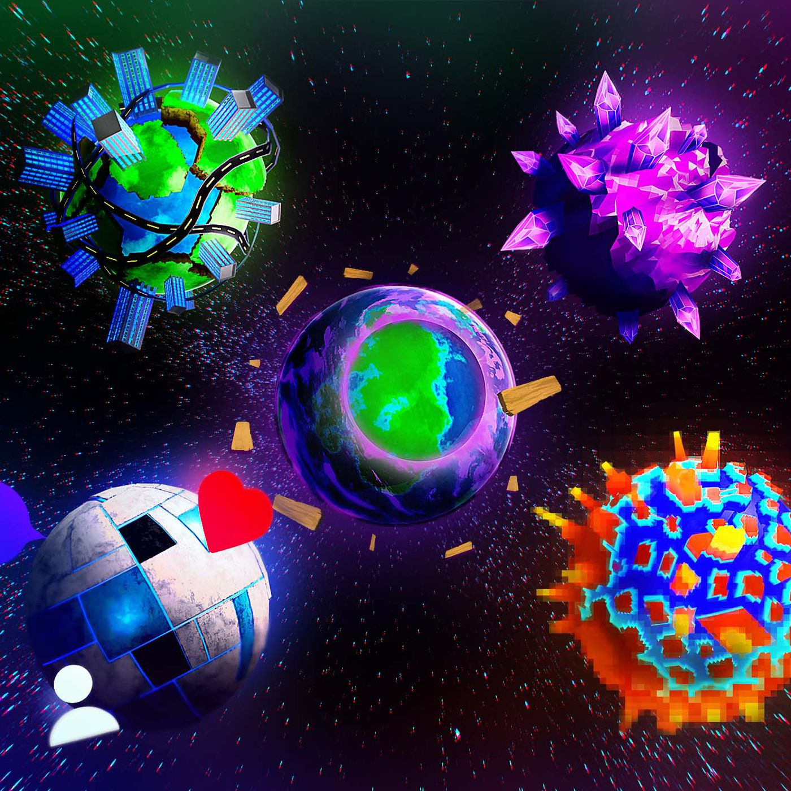

# Virtual Planets

When blockchain came into existence, it created a paradigm shift; making possible a **community-governed organization** where assets can exist in perpetual machines and value exchanges can be done reliably without any centralized authority.


`NOTE: This section is under active review.`


**ALTER** plans to create a platform that provides a new way to build community on **Web3.0** while also being driven by economics and governance

* A decentralized virtual world governed by the community
* An open economy infrastructure
* An open NFT protocol to make the objects in the virtual world usable
* A platform allowing user-created metaverses, experiences, and applications.

The ALTER serves individuals, influencers, entrepreneurs, and community owners looking to increase their engagement with their fans or followers.

* **Individuals** - Individual users can explore different metaverses, there will be a variety of cultures, games, and content. Users can join the metaverses and take ownership of the land and start mining, building the land to make the metaverse more attractive to the community.
* **Community owners** - Community owners can launch a metaverse world of their own style and choice, invite their social community to join, build and play. In your metaverse, members can help you build community while being rewarded. True fans can easily identify and reward themselves.
* **Businesses** - Companies can use their metaverses to promote their products and services. Turn your value proposition into a 3D land and map. Reward your website visitors while promoting your product.

