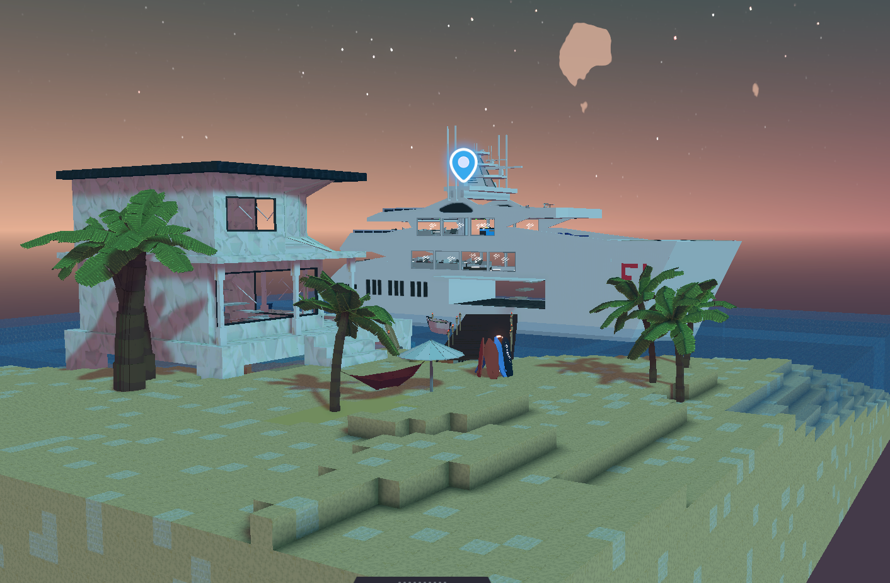
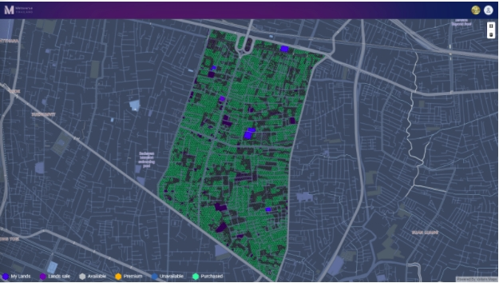
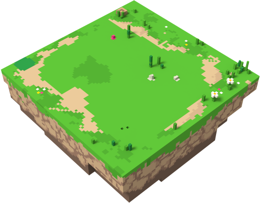

# Land Economics

ALTER aims to be a platform for entrepreneurs and new business owners to create successful and efficient communities.&#x20;

Providing a customer-friendly experience for classic internet users and a powerful platform for blockchain enthusiasts.&#x20;

The adopters of the platform have an interest in the property and have a say in the growth of the system. Individuals will find that new opportunities will be offered from both the network and individual metaverses.

* In ALTER-UNIVERSE users can create their own metaverse of different sizes containing **8000-10000 plots**.
* Created planet minted as **ERC 1155 NFT** and owner can create storyline, tasks and can trade their planets as well
* Planet owner can **Name their planet** sell lands as NFTs to players
* Planet owners can create their own **governance tokens** for their community

Planets can be customized however the owner wants and design their **own Map** to build their own community to interact with.

Each planet land contains 3 types of plots&#x20;

* SMALL (1x1) = 1 plots (500sm)
* MEDIUM (2x2) = 4 plots (2.000sm)
* LARGE (3x3) = 9 units (4.500sm)

Future supply or inflation will be determined by the governance of the general council.
