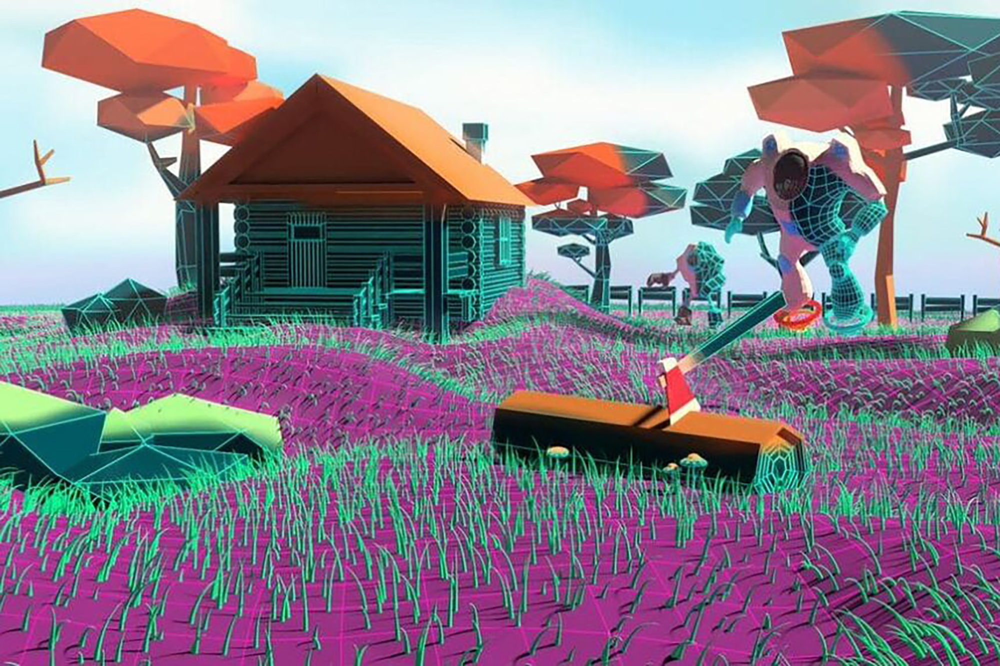

# UseCase

* **Planet owners** can sell lands inside their planet, sell assets and resources, and host events.
* OG planets will get paid when a new planet created **revenue shared across the other planets**.
* The owner of the land can **plan its development**. Users can develop 3D models, text, images, videos, and NFT assets within their own territory.

* A building on the Land can have its own internal space and users can enter the building and interact with the internal services.
* Members are able to express their will through **governance in the metaverse**.
* The market is **dedicated to the metaverse**, and only its assets are displayed there. When a social token is approved, users will be able to pay for the items with their tokens.
* Users can enter your world because of a specific game mode or mission. for example. Treasure hunt. **We are building APIs that will allow developers to create their own missions and gameplay**.
