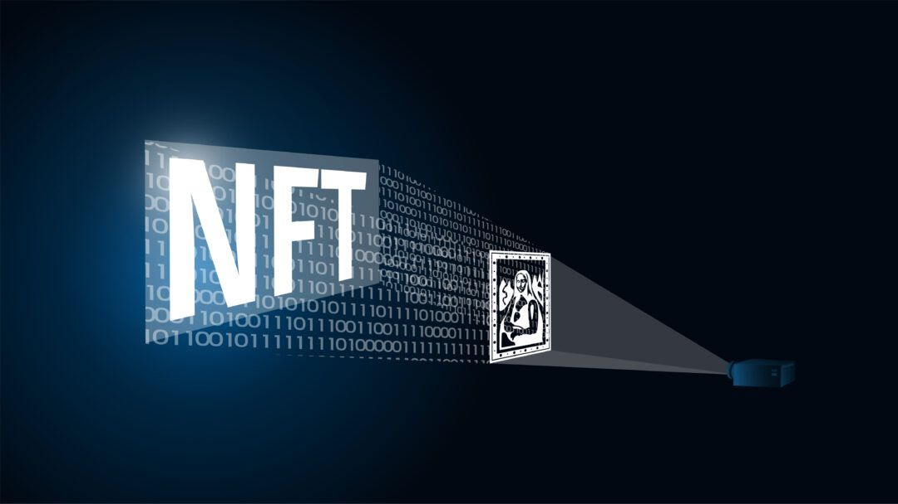

# Blockchain Technology

Polygon is the first well-structured, easy-to-use platform for Ethereum scaling and infrastructure development. Its core component is Polygon SDK, a modular, flexible framework that supports building and connecting **** Secured Chains like Plasma, Optimistic Rollups, zkRollups, Validium, etc, and Standalone Chains like Polygon POS, designed for flexibility and independence. 

* Polygon’s scaling solutions have seen widespread adoption with 450+ Dapps, \~350M transactions, and \~13.5M+ unique users.
* Games get 360-degree building support, big brands and much-loved franchises can launch on Polygon, and gamers can enjoy a whole new world of play to earn opportunities and decentralized gaming.

* ALTER use polygon tech due to its dominance in gaming space and high scalability all the NFTs in Alter Ecosystem will be minted on the polygon network.
*  ALTER'S underlying token also will be deployed on the Polygon network.
* And Integrate Moralis with ALTERs own infrastructure for the Real-time updates on-chain in the smart contracts and ability to give tools deploy on multichain.

